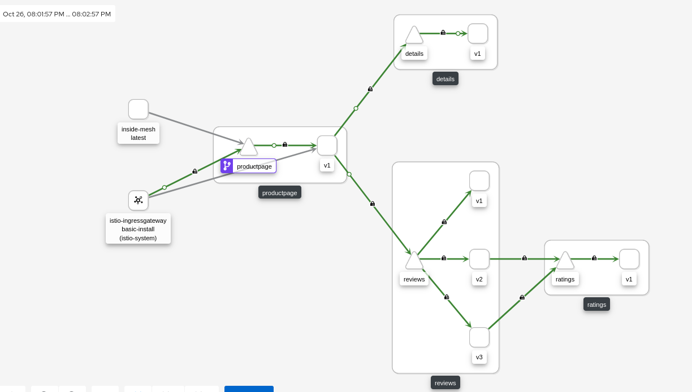

# mTLS Lab

Mutual authentication or two-way authentication refers to two parties authenticating each other at the same time, being a default mode of authentication in some protocols (IKE, SSH) and optional in others (TLS).

With Red Hat OpenShift Service Mesh, Mutual TLS can be used without either application/service knowing that it is happening. The TLS is handled entirely by the service mesh infrastructure and between the two sidecar proxies.

## A. Deploy mTLS (Permissive)

The mTLS Istio feature could be enable at the cluster level, or at namespace level. We will enable at the namespace level, demoing the Istio objects that controls mTLS security.

### A.1. Deploy Service Mesh mTLS for specific App

```sh
export bookinfo_namespace=bookinfo
export control_plane_namespace=istio-system
export control_plane_name=basic-install
export control_plane_route_name=api
```

```sh
DEPLOY_NAMESPACE=${bookinfo_namespace}
CONTROL_PLANE_NAMESPACE=${control_plane_namespace}
CONTROL_PLANE_NAME=${control_plane_name}
CONTROL_PLANE_ROUTE_NAME=${control_plane_route_name}

oc project ${DEPLOY_NAMESPACE}

helm upgrade -i basic-gw-config -n ${DEPLOY_NAMESPACE} \
  --set control_plane_namespace=${CONTROL_PLANE_NAMESPACE} \
  --set control_plane_name=${CONTROL_PLANE_NAME} \
  --set route_hostname=$(oc get route ${CONTROL_PLANE_ROUTE_NAME} -n ${CONTROL_PLANE_NAMESPACE} -o jsonpath={'.spec.host'}) \
  basic-gw-config -f basic-gw-config/values-mtls
```

Check the [PeerAuthentication](https://istio.io/latest/docs/reference/config/security/peer_authentication/) object generated in the Bookinfo namespace:

```
oc get peerauthentications.security.istio.io default -o jsonpath='{.spec}' | jq .
{
  "mtls": {
    "mode": "PERMISSIVE"
  }
}
`
```

PeerAuthentication defines how traffic will be tunneled (or not) to the sidecar.

In Mode PERMISSIVE the connection can be either plaintext or mTLS tunnel.

### A.2. Test the Bookinfo as a External User (outside the OCP Cluster)

```sh
GATEWAY_URL=$(echo https://$(oc get route ${control_plane_route_name} -n ${control_plane_namespace} -o jsonpath={'.spec.host'})/productpage)

curl $GATEWAY_URL -Iv
```

The result must be 200 OK as the curl below depicts:

```sh
...
> HEAD /productpage HTTP/1.1
> Host: api-istio-system.apps.XXX.com
> User-Agent: curl/7.76.1
> Accept: */*
>
* TLSv1.3 (IN), TLS handshake, Newsession Ticket (4):
* TLSv1.3 (IN), TLS handshake, Newsession Ticket (4):
* old SSL session ID is stale, removing
* Mark bundle as not supporting multiuse
< HTTP/1.1 200 OK
HTTP/1.1 200 OK
< content-type: text/html; charset=utf-8
content-type: text/html; charset=utf-8
< content-length: 4183
content-length: 4183
< server: istio-envoy
server: istio-envoy
...
<
* Connection #0 to host api-istio-system.apps.XXXX.com left intact
```

### A.3. Check Kiali service

```sh
echo https://$(oc get route -n $control_plane_namespace kiali -o jsonpath={'.spec.host'})
```



## A.4. Check the mTLS within/inside the Mesh

```sh
oc create deployment --image nginxinc/nginx-unprivileged inside-mesh -n $bookinfo_namespace
```

```sh
oc patch deploy/inside-mesh -p '{"spec":{"template":{"metadata":{"annotations":{"sidecar.istio.io/inject":"true"}}}}}' -n bookinfo
```

```sh
oc exec -ti deploy/inside-mesh -- bash
$ for i in {1..10}; do  curl -vI http://productpage:9080/productpage?u=normal && sleep 2; done
```

NOTE: All the requests must return HTTP 200 OK


## A.5. Check the mTLS outside the Mesh

```sh
oc create deployment --image nginxinc/nginx-unprivileged outside-mesh -n $bookinfo_namespace
```

```sh
oc exec -ti deploy/outside-mesh -- bash
$ for i in {1..10}; do  curl -vI http://productpage:9080/productpage?u=normal && sleep 2; done
```

NOTE: All the requests must return HTTP 200 OK


You will notice that there are requests originating from "unknown". That is the pod inside which the curl command was executed.

## B. Enforce mTLS with STRICT

## B.1. Enable the STRICT mTLS value (without PeerAuth)

```
helm upgrade -i basic-gw-config -n ${DEPLOY_NAMESPACE} \
  --set control_plane_namespace=${CONTROL_PLANE_NAMESPACE} \
  --set control_plane_name=${CONTROL_PLANE_NAME} \
  --set route_hostname=$(oc get route ${CONTROL_PLANE_ROUTE_NAME} -n ${CONTROL_PLANE_NAMESPACE} -o jsonpath={'.spec.host'}) \
  basic-gw-config -f basic-gw-config/values-mtls-strict.yaml
```

```
oc get peerauthentications.security.istio.io default -o jsonpath='{.spec}' | jq .
{
  "mtls": {
    "mode": "STRICT"
  }
}
```

In Mode STRICT the connection is an mTLS tunnel (TLS with client cert must be presented).

### B.2. Test the Bookinfo as a External User (outside the OCP Cluster)

```sh
GATEWAY_URL=$(echo https://$(oc get route ${control_plane_route_name} -n ${control_plane_namespace} -o jsonpath={'.spec.host'})/productpage)

curl $GATEWAY_URL -Iv
```

```
 curl $GATEWAY_URL -I
HTTP/1.1 200 OK
content-type: text/html; charset=utf-8
content-length: 5179
server: istio-envoy
date: Tue, 26 Oct 2021 14:59:54 GMT
x-envoy-upstream-service-time: 54
set-cookie: 9023cfc9bfd45f5dc28756be7ac3bd3e=d8c5201aae101ce45ff167c09f1d6910; path=/; HttpOnly; Secure; SameSite=None
cache-control: private
```

### B.3. Test the Bookinfo as a External User (outside the OCP Cluster)
