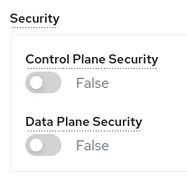
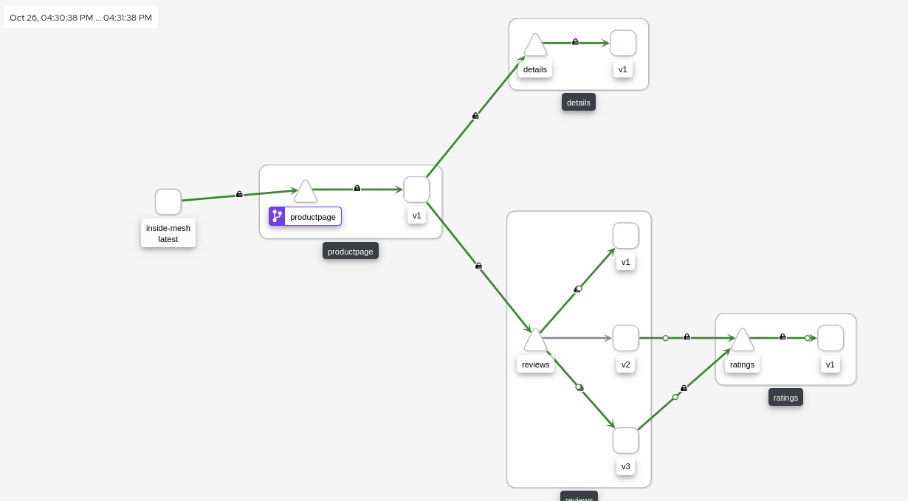
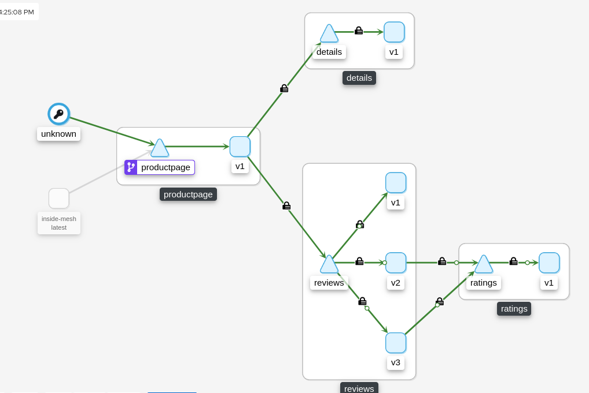
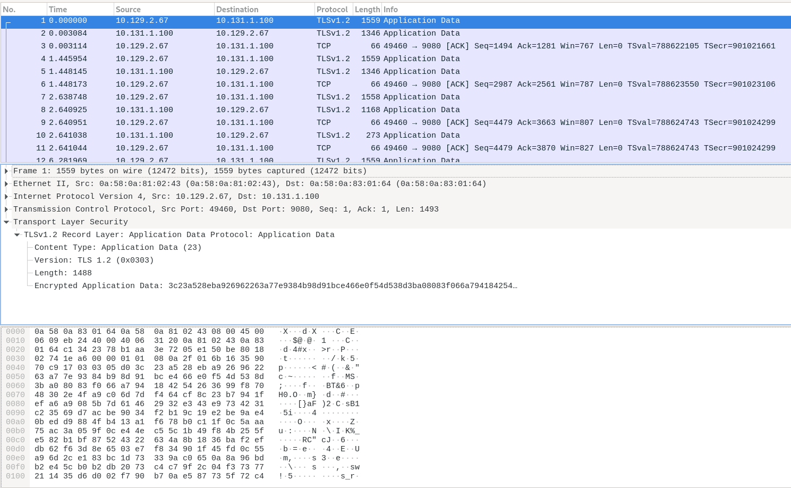
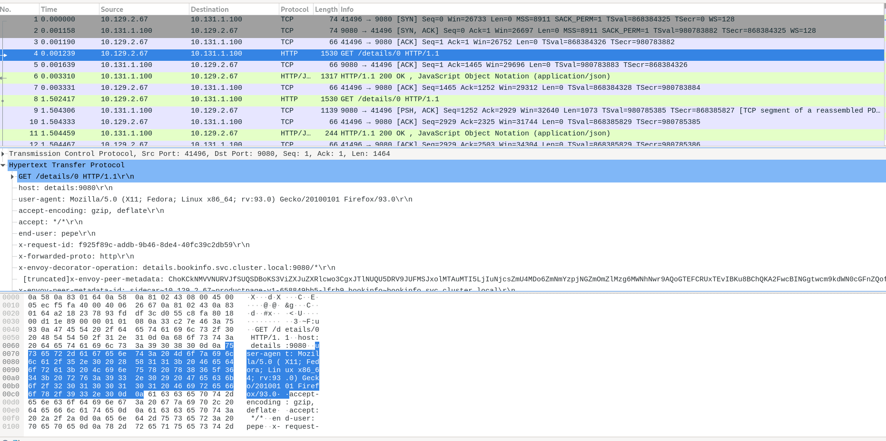

# mTLS Lab

Mutual authentication or two-way authentication refers to two parties authenticating each other at the same time, being a default mode of authentication in some protocols (IKE, SSH) and optional in others (TLS).

With Red Hat OpenShift Service Mesh, Mutual TLS can be used without either application/service knowing that it is happening. The TLS is handled entirely by the service mesh infrastructure and between the two sidecar proxies.

The mTLS Istio feature could be enable at the cluster level, or at namespace level. We will enable at the namespace level, demoing the Istio objects that controls mTLS security.

In the deployment of the lab, we disabled the mtls and the automtls at the ServiceMeshControlPlane, because we want to control everything at the namespace level (and trick the mTLS to be disabled):



At the ServiceMeshControlPlane in the yaml cluster we can see the specific CR for the security part of the Mesh Control Plane:

```sh
oc get smcp -n istio-system basic-install -o jsonpath='{.spec.security}' | jq .
{
  "controlPlane": {
    "mtls": false
  },
  "dataPlane": {
    "automtls": false,
    "mtls": false
  }
}
```

NOTE: A PeerAuthentication by default it's generated in the Istio Control Plane namespace (istio-system in our case).

With this you can have the full control of the PeerAuthentications and the Destination Rules generated in the cluster, but on the other hand are not automated by the ServiceMeshControlPlane and Service Mesh Operators and you need to provide them in each case.

## A. Deploy mTLS in Permissive Mode

### A.1. Deploy Service Mesh mTLS for specific App (namespace level)

As we described before we can enable the mtls at the namespace level as the [Service Mesh documentation](https://docs.openshift.com/container-platform/4.9/service_mesh/v2x/ossm-security.html#ossm-security-mtls_ossm-security) specifies.

Let's deploy the Istio objects that are required for enable the mTLS at the namespace level: 

```sh
export bookinfo_namespace=bookinfo
export control_plane_namespace=istio-system
export control_plane_name=basic-install
export control_plane_route_name=api
```

```sh
DEPLOY_NAMESPACE=${bookinfo_namespace}
CONTROL_PLANE_NAMESPACE=${control_plane_namespace}
CONTROL_PLANE_NAME=${control_plane_name}
CONTROL_PLANE_ROUTE_NAME=${control_plane_route_name}

oc project ${DEPLOY_NAMESPACE}

helm upgrade -i basic-gw-config -n ${DEPLOY_NAMESPACE} \
  --set control_plane_namespace=${CONTROL_PLANE_NAMESPACE} \
  --set control_plane_name=${CONTROL_PLANE_NAME} \
  --set route_hostname=$(oc get route ${CONTROL_PLANE_ROUTE_NAME} -n ${CONTROL_PLANE_NAMESPACE} -o jsonpath={'.spec.host'}) \
  basic-gw-config -f basic-gw-config/values-mtls.yaml
```

* Check the [PeerAuthentication](https://istio.io/latest/docs/reference/config/security/peer_authentication/) object generated in the Bookinfo namespace:

```
oc get peerauthentications.security.istio.io default -o jsonpath='{.spec}' -n $bookinfo_namespace | jq .
{
  "mtls": {
    "mode": "PERMISSIVE"
  }
}
```

PeerAuthentication defines how traffic will be tunneled (or not) to the sidecar. In Mode PERMISSIVE the connection can be either plaintext or mTLS tunnel.

For more information check the [Modes of PeerAuthentication](https://istio.io/latest/docs/reference/config/security/peer_authentication/#PeerAuthentication-MutualTLS-Mode).

### A.2. Test the Bookinfo as a External User (outside the OCP Cluster)

Let's test the app from outside the OCP cluster, simulating as we are a user of our application:

```sh
GATEWAY_URL=$(echo https://$(oc get route ${control_plane_route_name} -n ${control_plane_namespace} -o jsonpath={'.spec.host'})/productpage)

curl $GATEWAY_URL -Iv
```

The result must be 200 OK as the curl below depicts:

```sh
...
> HEAD /productpage HTTP/1.1
> Host: api-istio-system.apps.XXX.com
> User-Agent: curl/7.76.1
> Accept: */*
>
* TLSv1.3 (IN), TLS handshake, Newsession Ticket (4):
* TLSv1.3 (IN), TLS handshake, Newsession Ticket (4):
* old SSL session ID is stale, removing
* Mark bundle as not supporting multiuse
< HTTP/1.1 200 OK
HTTP/1.1 200 OK
< content-type: text/html; charset=utf-8
content-type: text/html; charset=utf-8
< content-length: 4183
content-length: 4183
< server: istio-envoy
server: istio-envoy
...
<
* Connection #0 to host api-istio-system.apps.XXXX.com left intact
```

### A.3. Check Kiali service

* Let's check the Kiali service:

```sh
echo https://$(oc get route -n $control_plane_namespace kiali -o jsonpath={'.spec.host'})
```

* In the Kiali we can see (with the mTLS Security flag enabled), that from the request goes thought the ingressGW and all the traffic between our microservices of our app is encrypted with mTLS:  


## A.4. Check the mTLS within/inside the Mesh

Let's do a test inside our mesh application, simulating that the requests comes from another pod but INSIDE the mesh.

* Deploy a test application for execute the tests:

```sh
oc create deployment --image nginxinc/nginx-unprivileged inside-mesh -n $bookinfo_namespace
```

* Enable the autoinjection, patching the deployment of ou application adding an annotation the sidecar.istio.io/inject to true:

```sh
oc patch deploy/inside-mesh -p '{"spec":{"template":{"metadata":{"annotations":{"sidecar.istio.io/inject":"true"}}}}}' -n bookinfo
```

* Inside the pod execute several requests toward the ProductPage microservice:

```sh
oc exec -ti deploy/inside-mesh -- bash
$ for i in {1..10}; do curl -vI http://productpage:9080/productpage?u=normal && sleep 2; done
```

* All the requests must return HTTP 200 OK



If you noticed, the request does not come from the Ingress Gw, it's coming from the Inside-Mesh pod. Cool, isn't?

## A.5. Check the mTLS outside the Mesh

Now it's the turn to demonstrate that with the Mode PERMISSIVE, the traffic that's allowed in our Mesh namespace can be in mTLS and also in Plain Text (HTTP). 

* Let's generate another deployment for execute the test but without injecting the Istio sidecar:

```sh
oc create deployment --image nginxinc/nginx-unprivileged outside-mesh -n $bookinfo_namespace
```

* In the the Outside Pod, execute the same request as before: 

```sh
oc exec -ti deploy/outside-mesh -- bash
$ for i in {1..10}; do  curl -vI http://productpage:9080/productpage?u=normal && sleep 2; done
```

NOTE: All the requests must return HTTP 200 OK



You will notice that there are requests originating from "unknown". That is the pod inside which the curl command was executed.

### A.6 Check the encryption between microservices with mTLS in Permissive mode

Now let's check if our traffic it's encrypted using the [istioctl tools](https://istio.io/latest/docs/setup/getting-started/#download), with the flag of [experimental authz check](https://istio.io/latest/docs/reference/commands/istioctl/#istioctl-experimental-authz-check) directly in one of the pods (we selected randomly the Details but works with the others).

* Let's execute the experimental authz check with the pod id and grepping for virtual, for checking the status of the Envoy configuration in the Pod:

```
istioctl experimental authz check $(kubectl get pods -n bookinfo | grep details| head -1| awk '{print $1}') | grep virtual
Checked 13/25 listeners with node IP 10.131.1.100.
LISTENER[FilterChain]     CERTIFICATE          mTLS (MODE)          AuthZ (RULES)
...
virtualOutbound[0]        none                 no (none)            no (none)
virtualOutbound[1]        none                 no (none)            no (none)
virtualInbound[0]         none                 no (none)            no (none)
virtualInbound[1]         noneSDS: default     yes (none)           no (none)
virtualInbound[2]         none                 no (none)            no (none)
virtualInbound[3]         noneSDS: default     yes (none)           no (none)
virtualInbound[4]         none                 no (none)            no (none)
virtualInbound[5]         none                 no (none)            no (none)
virtualInbound[6]         noneSDS: default     yes (PERMISSIVE)     no (none)
virtualInbound[7]         none                 no (PERMISSIVE)      no (none)
virtualInbound[8]         noneSDS: default     yes (PERMISSIVE)     no (none)
virtualInbound[9]         none                 no (PERMISSIVE)      no (none)
0.0.0.0_15010             none                 no (none)            no (none)
0.0.0.0_15014             none                 no (none)            no (none)
```

Notice that mTLS is enabled in the virtual inbounds.

* To validate how traffic is sent through Istio proxies, we will be using the [Ksniff](https://github.com/eldadru/ksniff) utility.

```sh
POD_PRODUCTPAGE=$(oc get pod | grep productpage | awk '{print $1}')

DETAILS_IP=$(oc get pod -o wide | grep details | awk '{print $6}')
echo $DETAILS_IP
```

In the previous case the Details IP is 10.131.1.100.

* Then let’s sniff the traffic that is sent from the ProductPage pod to the Details v1 pod by running:

```sh
kubectl sniff -i eth0 -o ./mtls.pcap $POD_PRODUCTPAGE -f '((tcp) and (net 10.131.1.100))' -n bookinfo -p -c istio-proxy
```

```sh
INFO[0000] sniffing method: privileged pod
INFO[0000] sniffing on pod: 'productpage-v1-658849bb5-lfrh9' [namespace: 'bookinfo', container: 'istio-proxy', filter: '((tcp) and (net 10.131.1.100))', interface: 'eth0']
INFO[0000] creating privileged pod on node: 'xxxx'
INFO[0000] pod: 'ksniff-wn8t4' created successfully in namespace: 'bookinfo'
INFO[0000] waiting for pod successful startup
INFO[0007] pod: 'ksniff-wn8t4' created successfully on node: 'xxxxx'
INFO[0007] executing command: '[chroot /host crictl inspect --output json ac2bda75954daf1c4e4ab48c0ffdf7a59a36cb83cbbb9649d89deb420f572ab4]' on container: 'ksniff-privileged', pod: 'ksniff-wn8t4', namespace: 'bookinfo'
INFO[0008] command: '[chroot /host crictl inspect --output json ac2bda75954daf1c4e4ab48c0ffdf7a59a36cb83cbbb9649d89deb420f572ab4]' executing successfully exitCode: '0', stdErr :''
INFO[0008] output file option specified, storing output in: './mtls.pcap'
INFO[0008] starting remote sniffing using privileged pod
INFO[0008] executing command: '[nsenter -n -t 2430077 -- tcpdump -i eth0 -U -w - ((tcp) and (net 10.131.1.100))]' on container: 'ksniff-privileged', pod: 'ksniff-wn8t4', namespace: 'bookinfo'
```

* So now go to a new terminal window and execute:

```
curl $GATEWAY_URL -I
```

* Then move to kubectl sniff terminal window and stop the process (Ctrl+C).

* At the same directory, you have a file named mtls.pcap which is the captured traffic, you can use Wireshark to open the file, and you’ll see something like:



If you check the pcap file with Wireshark, all the traffic it's encrypted with TLS1.x from and to all the microservices, because we enabled the mTLS feature in the PeerAuthentication object with the mode PERMISSIVE. 

## B. Deploy mTLS with mode DISABLE

Now, let's see what

```sh
helm upgrade -i basic-gw-config -n ${DEPLOY_NAMESPACE} \
  --set control_plane_namespace=${CONTROL_PLANE_NAMESPACE} \
  --set control_plane_name=${CONTROL_PLANE_NAME} \
  --set route_hostname=$(oc get route ${CONTROL_PLANE_ROUTE_NAME} -n ${CONTROL_PLANE_NAMESPACE} -o jsonpath={'.spec.host'}) \
  basic-gw-config -f basic-gw-config/values-mtls-disabled.yaml
```

```sh
istioctl experimental authz check $(kubectl get pods -n bookinfo | grep details| head -1| awk '{
print $1}')
Checked 13/25 listeners with node IP 10.131.1.100.
LISTENER[FilterChain]     CERTIFICATE     mTLS (MODE)     AuthZ (RULES)
0.0.0.0_80                none            no (none)       no (none)
0.0.0.0_3000              none            no (none)       no (none)
0.0.0.0_5778              none            no (none)       no (none)
0.0.0.0_9080              none            no (none)       no (none)
0.0.0.0_9090              none            no (none)       no (none)
0.0.0.0_9411              none            no (none)       no (none)
0.0.0.0_14250             none            no (none)       no (none)
0.0.0.0_14267             none            no (none)       no (none)
0.0.0.0_14268             none            no (none)       no (none)
virtualOutbound[0]        none            no (none)       no (none)
virtualOutbound[1]        none            no (none)       no (none)
virtualInbound[0]         none            no (none)       no (none)
virtualInbound[1]         none            no (none)       no (none)
virtualInbound[2]         none            no (none)       no (none)
virtualInbound[3]         none            no (none)       no (none)
virtualInbound[4]         none            no (none)       no (none)
virtualInbound[5]         none            no (none)       no (none)
0.0.0.0_15010             none            no (none)       no (none)
0.0.0.0_15014             none            no (none)       no (none)
```

Notice that mTLS is not enabled in the virtual inbounds.

To validate how traffic is sent through Istio proxies in plain text, we will be using the [Ksniff](https://github.com/eldadru/ksniff) utility.

```sh
POD_PRODUCTPAGE=$(oc get pod | grep productpage | awk '{print $1}')

DETAILS_IP=$(oc get pod -o wide | grep details | awk '{print $6}')
echo $DETAILS_IP
```

In the previous case the Details IP is still 10.131.1.100.

Then let’s sniff the traffic that is sent from the ProductPage pod to the Details v1 pod by running:

```sh
kubectl sniff -i eth0 -o ./mtls-disabled.pcap $POD_PRODUCTPAGE -f '((tcp) and (net 10.131.1.100))' -n bookinfo -p -c istio-proxy
```

Once we have the Kniff executed, we need to perform some requests:

```
curl $GATEWAY_URL -I
```

* Then move to kubectl sniff terminal window and stop the process (Ctrl+C).

* At the same directory, you have a file named mtls-disabled.pcap which is the captured traffic, you can use Wireshark to open the file, and you’ll see something like:



If you check the pcap file with Wireshark, now the traffic it's NOT encrypted and it's in Plain Text! So if anybody do a Man in the Middle attack we can leak sensitive information!

## C. Enforce mTLS with STRICT

Now let's enforce the use of the mTLS in all of the inbound and outbound traffic using the mTLS mode STRICT.

## C.1. Enable the STRICT mTLS value (without PeerAuth)

```
helm upgrade -i basic-gw-config -n ${DEPLOY_NAMESPACE} \
  --set control_plane_namespace=${CONTROL_PLANE_NAMESPACE} \
  --set control_plane_name=${CONTROL_PLANE_NAME} \
  --set route_hostname=$(oc get route ${CONTROL_PLANE_ROUTE_NAME} -n ${CONTROL_PLANE_NAMESPACE} -o jsonpath={'.spec.host'}) \
  basic-gw-config -f basic-gw-config/values-mtls-strict.yaml
```

```sh
oc get peerauthentications.security.istio.io default -o jsonpath='{.spec}' | jq .
{
  "mtls": {
    "mode": "STRICT"
  }
}
```

In Mode STRICT the connection is an mTLS tunnel (TLS with client cert must be presented).

NOTE: It may take some time before the mesh begins to enforce PeerAuthentication object. Please wait and retry.

On the other hand, as we not enabled the automatic mTLS, and we have the PeerAuthentication to STRICT we need to create a DestinationRule resource for our application service.

Create a destination rule to configure Maistra to use mTLS when sending requests to other services in the mesh.

```sh
oc get dr bookinfo-mtls -o jsonpath='{.spec}' | jq .
{
  "host": "*.bookinfo.svc.cluster.local",
  "trafficPolicy": {
    "tls": {
      "mode": "ISTIO_MUTUAL"
    }
  }
}
```

### C.2. Test the Bookinfo as a External User (outside the OCP Cluster)

```sh
GATEWAY_URL=$(echo https://$(oc get route ${control_plane_route_name} -n ${control_plane_namespace} -o jsonpath={'.spec.host'})/productpage)

curl $GATEWAY_URL -I
```

```sh
$ curl $GATEWAY_URL -I
HTTP/1.1 200 OK
content-type: text/html; charset=utf-8
content-length: 5179
server: istio-envoy
date: Tue, 26 Oct 2021 14:59:54 GMT
x-envoy-upstream-service-time: 54
set-cookie: 9023cfc9bfd45f5dc28756be7ac3bd3e=d8c5201aae101ce45ff167c09f1d6910; path=/; HttpOnly; Secure; SameSite=None
cache-control: private
```

### C.3 Check the mTLS within/inside the Mesh

```sh
oc exec -n bookinfo -ti deployment/inside-mesh -- bash
```

```sh
oc exec -ti deploy/outside-mesh -- bash
$ for i in {1..10}; do  curl -vI http://productpage:9080/productpage?u=normal && sleep 2; done
```

NOTE: All the requests must return HTTP 200 OK


### C.4. Check the mTLS outside the Mesh

Let's test again the connection from outside the mesh:

```sh
oc exec -n bookinfo -ti deployment/outside-mesh -- bash
```

```sh
1000760000@outside-mesh-847dd9c646-6vj2b:/$ curl http://productpage:9080/productpage?u=normal -Iv
...
...
* Expire in 200 ms for 4 (transfer 0x560642d40c10)
* Connected to productpage (172.30.64.160) port 9080 (#0)
> HEAD /productpage?u=normal HTTP/1.1
> Host: productpage:9080
> User-Agent: curl/7.64.0
> Accept: */*
>
* Recv failure: Connection reset by peer
* Closing connection 0
curl: (56) Recv failure: Connection reset by peer
```

We can see that the curl from the curl pod failed with exit code 56.

This is because preference is now requiring encrypted communication over mutual TLS (STRICT) via a Peer Authentication Istio object, but the curl pod (which is outside the mesh) is not attempting to use mutual TLS.

## D. Best Practices with mTLS and Service Mesh

TO BE FINISHED